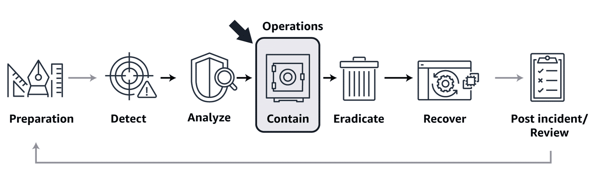

# AWS Security Incident Response Lab
This repository documents my learning journey on AWS Security Incident Response, based on hands-on study and practical scenarios.

The goal is to understand how to detect, investigate, contain, and prevent security incidents in AWS cloud environments.

---

## Objectives

- Understand the incident response lifecycle in AWS
- Investigate suspicious activity using CloudTrail and GuardDuty
- Define containment actions for compromised credentials
- Document playbooks for real-world cloud security scenarios
- Explore automation for faster response

---

## Security Incident Definition
Security incident response is an essential part of IT programs. Cybersecurity-related issues are numerous and diverse. They are damaging and disruptive, and new types of security-related incidents emerge frequently. 

## Response Process
The foundation of a successful incident response program in the cloud includes preparation, operations, and post-incident activity. 



## Security incident response workflow
To respond to security incidents effectively and robustly, the following phases serve as a guideline.

- Prepare: preparation is done  across three areas.
    - People: identify stakeholders, and train them on incident response  and cloud technologies.
    - Process: document architectures, create playbooks for consistent response to security events.
    - Technology: set up access, aggregate and monitor necessary logs, implement alerting mechanisms.

- Detect: identify a potential security incident.
    - an alert in the main component of the detect phase. It generates  a notification to initiate the incident response processo.

- Analyse: Determine if the security event is an incident and assess the scope of the incident.

## Key Topics

- AWS GuardDuty
- AWS CloudTrail
- AWS Security Hub
- AWS IAM
- VPC Flow Logs
- Incident triage
- Containment and remediation
- Root Cause Analysis (RCA)

---

## Incident Response Flow

```text
Detect → Triage → Contain → Investigate → Eradicate → Recover → Learn