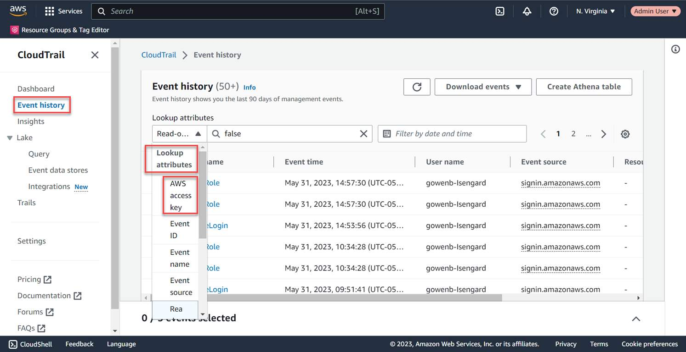
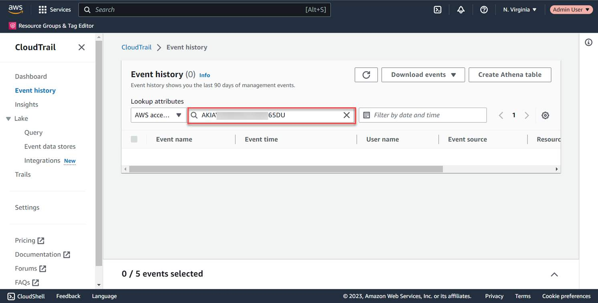

### Detection phase of incident
The following steps outline ways for security teams to identify potential threats or ongoing attacks within their environment.

#### Review AWS service notifications
- Monitor Health Dashboard for service notifications
- Check Personal Health Dashboard (PHD) for account-specific alerts
- Configure and review Health events in Amazon EventBridge

#### Review AWS CloudTrail logs
- Analyze API activity and management events
- Monitor data events for specific services
- Check for unauthorized or unusual API calls

#### Monitor AWS security service findings
Monitor the findings of services such as 
- AWS Security Hub
- Amazon GuardDuty
- Amazon Macie
- Amazon Inspector
- AWS Config

Examples of interpreting service findings:

If AWS Security Hub shows a high-severity finding where an IAM user successfully created a new access key and modified security group rules within a short timeframe, this could indicate credential compromise requiring immediate investigation.

If Amazon GuardDuty detects an EC2 instance making outbound connections to known cryptocurrency mining pools while also showing unusually high CPU utilization, this could indicate that the instance has been compromised and is being used for cryptojacking, requiring immediate investigation.

#### Analyze AWS CloudWatch alarms
- Monitor application logs in AWS CloudWatch Logs
- Check composite alarms for complex conditions
- Review metric alarms for resource utilization

#### Investigate VPC Flow Logs
- Examine network traffic patterns
- Identify unusual traffic flows
- Look for suspicious IP addresses

#### Demonstration of Detection an alert
Navigate to Amazon GuardDuty to confirm the alert.

## Analyze phase
The following steps outline ways for security teams to analyze threats or ongoing attacks within their environment.

### View event history
Navigate to AWS CloudTrail and select Event history to view the event history. To review the events associated with the exposed Access key ID, in the first attributes field, choose AWS access key.

### Review events associated with the exposed Access key ID
In the second Lookup attributes field, enter the compromised AWS access key – AKIA…6D5U.

### Determine compromised user
Review the CloudTrail Event history to determine when activity was performed using the compromised Access key.

- The Event time column tells the date and time the user used the compromised Access key ID.
- The User name column shows the username associated with the Access key.

#### Validate, scope, and assess impact of the alert
- Validate the alert. Make sure it is not a false positive.
- Define the scope. Inventory all resources involved and determine the incident severity.
- Determine potential impact and the actual business disruption.
- Prioritize the investigation based on business impact.

#### Collect evidence and create context
- Capture volatile data first. Document all collection methods and timestamps.
- Gather relevant logs, metrics, and system data while maintaining a chain of custody.
- Use AWS-native tools like AWS CloudWatch, AWS CloudTrail, VPC Flow Logs
- Use threat intelligence and automation to provide deeper context and more efficient analysis of security events.

#### Develop narratives
- Determine how the incident occurred and identify the initial compromise vector.
- Create a detailed chronological sequence of events.
- Identify vulnerabilities or misconfigurations exploited and document for future prevention.
- Map lateral movement and escalation attempts.